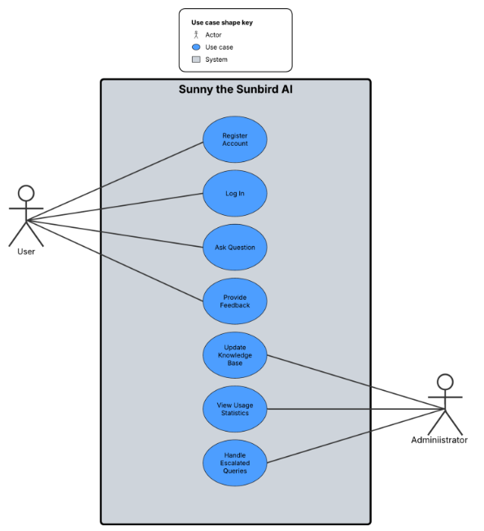

# ChatBot using Gemini API and streamlit

 ## Team Formation/Role Assignments
 | Team Member | Role |
---|---
| Martin Ramirez | AI Integration Developer |
| Angel Espana del Rio | Frontend Developer |
| Elmer Carballo | Backend Developer |
| Daniel Mota | Documentation Expert |

## 1. Introduction
>Sunny The Sunbird AI is an AI model designed to assist those who may have questions about things regarding Fresno Pacific University.

### 1.1 Purpose 
>This document details the functions and certain design elements of the AI model/site.

### 1.2 Intended Audience and Reading Suggestions
>This document is primarily intended to explain the requirements, value, and functionality of Sunny The Sunbird AI for those who may be reviewing the project.

### 1.3 Product Scope
>Sunny the Sunbird is an AI model intended to answer questions that students, professors, or even visitors may have, as well as offering assistance where it is needed.

## 2. Overall Description

### 2.1 Product Perspective
>This ChatBot is a conversational bot designed to address various questions about Fresno Pacific University. It automatically processes information from a provided PDF file and leverages the Gemini API for processing techniques and responds to user inquiries effectively.
### 2.2 Product Functions
>Major functions include: Information processing, Usage Statistics

### 2.3 User Classes and Characteristics
>Student Persona: Fresno Pacific University student needing efficient support for university-related tasks. 
>- Needs quick answers to FAQs, redirection to official resources, and university-related event updates.

>Professor Persona: Fresno Pacific University faculty member seeking information to support teaching and student guidance. 
>- Needs access to academic policies, departmental contact details, and updates on university events relevant to faculty responsibilities.

>Visitor Persona: An individual exploring Fresno Pacific University’s campus or services, such as prospective students, parents, or event attendees. 
>- Needs general information about campus facilities (e.g., athletic complexes, parking), directions, and public event schedules. 

>Administrator Persona: Fresno Pacific University staff managing student inquiries. 
>- Needs reduced workload through automation and insights into common student questions.

### 2.4 Operating Environment
>Google Gemini was used as a base for the AI model, and a PDF containing information is what the AI draws from to answer the user.

### 2.5 Design and Implementation Constraints
>Sunny the Sunbird will be implemented as a website that hosts the AI model, though as of now is currently seperated from Fresno Pacific University's online resources, so even if these resources were to malfunction for whatever reason, the site would still work.

### 2.6 User Documentation
>The user is prompted to ask questions about Fresno Pacific University to the AI model, though what they ask is up to them, the AI will likely not respond to unrelated questions properly.

### 2.7 Assumptions and Dependencies
>It is assumed that
>* The user types questions related to Fresno Pacific University and its services
>* Google Gemini remains operational

## 3. External Interface Requirements

### 3.1 User Interfaces

## Overview
This ChatBot is a conversational bot designed to address various questions about Fresno Pacific University. It automatically processes information from a provided PDF file and leverages the Gemini API for processing techniques and responds to user inquiries effectively.

## Features
- **Automatic PDF Processing:** The application automatically extracts text from a provided PDF file.
- **Conversational Interface:** Users can interact with the bot by asking questions related to the content of the PDF file.
- **Dynamic Chat History:** The application maintains a chat history, displaying both user questions and bot responses.
- **Natural Language Understanding:** The bot employs advanced language models to understand and respond to user queries effectively.

## Contributing
Contributions to this ChatBot project are welcome! If you find any issues or have suggestions for improvements, please feel free to open an issue or submit a pull request.

## Project Goal:
This project aims to develop an AI-driven university chatbot, "Sunny the Sunbird AI," that enhances the student experience by providing quick and accurate answers to common inquiries, reducing administrative workload through automation, and offering 24/7 accessibility to university resources. The chatbot aims to solve the problem of delayed responses to student questions and difficulty navigating university systems, bringing value by streamlining access to information and supporting students with basic tasks such as answering FAQs, redirecting to official websites, and providing event updates. 

## Project Scope:

In-Scope:
- AI-driven chatbot with natural language processing (NLP) 
- Web-based accessibility 
- Redirection to official university websites for forms, policies, and resources 
- Departmental contact information (e.g., office hours, phone numbers) 
- AI-powered search to summarize university policies from approved sources 
- Feedback collection to improve chatbot performance

Out-of-Scope:
- Voice-enabled features (to be considered in future versions) 
- Integration into university systems (to be considered in future versions) 
- Access to confidential student records or grades 
- Guaranteeing 100% accuracy in AI-generated responses 
- Handling complex inquiries requiring human advisors  

Objectives
- Develop a fully functional chatbot minimum viable product (MVP) within 10 weeks 
- Achieve at least 85% accuracy in responding to student queries 
- Achieve a user satisfaction score of 80% or higher within the first month of launch 
- Leave the first version of the chatbot ready to integrate with university systems in future versions

## Initial Brainstorming Session Output
Potential User Personas:

Student Persona: Fresno Pacific University student needing efficient support for university-related tasks. 
- Needs quick answers to FAQs, redirection to official resources, and university-related event updates.

Professor Persona: Fresno Pacific University faculty member seeking information to support teaching and student guidance. 
- Needs access to academic policies, departmental contact details, and updates on university events relevant to faculty responsibilities.

Visitor Persona: An individual exploring Fresno Pacific University’s campus or services, such as prospective students, parents, or event attendees. 
- Needs general information about campus facilities (e.g., athletic complexes, parking), directions, and public event schedules. 

Administrator Persona: Fresno Pacific University staff managing student inquiries. 
- Needs reduced workload through automation and insights into common student questions. 

## Key Features Identified

- AI-powered Q&A system for general inquiries (e.g., admissions, deadlines, services) 
- Personalized student support 
- Course registration assistance 
- Website redirection to official university pages (e.g., forms, policies) 
- Departmental contact details (e.g., office hours, emails) 
- AI-powered search to summarize university policies 
- Web-based access 
- Feedback collection for reporting inaccurate or unhelpful responses

## Technical Considerations

- Use of GPT-based NLP models for understanding and generating responses 
- Compliance with data privacy policies (e.g., GDPR, FERPA) 
- Compliance with university policies 
- Scalable cloud infrastructure to support user traffic 
- Simple UI/UX design for ease of use across devices 

## Competitor University Chatbots

- https://www.bulldoggenie.ai/ Fresno State AI 
- https://zotgpt.uci.edu/zotgpt/ UC Irvine Chatbot 
- https://heysunny.asu.edu/ Arizona State University: Hey Sunny 

## Functional Requirements

1. User interaction with chatbot 
- User can submit prompts about FPU and receive a detailed response back 
- Interaction with chatbot that ensures answers about the University and understanding and processing of natural language input. 

2. User Feedback 
- User must be able to provide feedback in case of malfunction 
- Feedback about the AI chatbot for outdated information or malfunction 

## Non-Functional Requirements

1. Performance: The system should handle 4,000 concurrent users with a response time below 500 milliseconds. 
2. Scalability: The application should support growth in the number of users and data volume. 
3. Security: All sensitive user data must be encrypted. 
4. Usability: The UI/UX should be intuitive and accessible. 
5. Availability: System uptime should be 99.9% or higher. 
6. Compliance: The software must comply with FERPA and GDPR standards, state laws and university policies. 

## Use Case Diagram

## User Stories

1. As a student, I want to ask Sunny about places to study so that I can have different places to study in the University. 
- Acceptance Criteria: The AI should fetch and display all the study places throughout campus 

2. As a student, I want to know the library hours so that I can plan my study and reading times. 
- Acceptance Criteria: The AI should provide accurate and up-to-date information about the library operating hours. 

3. As a professor, I want to ask Sunny about academic policies so that I can guide my students properly. 
- Acceptance Criteria: The AI should fetch and display official university academic policies. 

4. As a visitor, I want to ask Sunny where the athletic facilities are on campus. 
- Acceptance Criteria: The AI should provide the address for the different sport complexes. 

5. As an administrator at Fresno Pacific University, I want to review the most frequently asked questions by users. 
- Acceptance Criteria: The AI should provide a report with the top ten most frequently asked questions over a certain period of time (e.g., weekly or monthly) 

## Initial Chatbot Conversation FLow

Overview:
This chatbot will handle users’ queries related to Fresno Pacific University. Offering guidance on academics, athletics, administration, campus resources, and events from FPU. 

## Sample Conversation Flow

User: "Hi, I need help with cafeteria hours and food." 

Chatbot: "Hello! I’m your assistant Sunny. What day do you want to know hours and food they are having? 

User: "For Tuesday." 

Chatbot: "For this week the hours are from 8am to 7pm. As for food we have the menu of the day that consists of Tacos, rice and beans for lunch, and for dinner we have steak and vegetables for this Tuesday” 

User: "Thanks" 

Chatbot: "You can find more information through this link, for this week’s times and food” 

## Additional Chatbot Features

Natural Language Processing (NLP): Understanding user intent. 

Integration with Support System: Escalation to human agents. 

Multilingual Support: Enabling conversations in multiple languages. 

## Conclusion

This document provides a structured approach to software product design by outlining requirements, user stories, and chatbot flows. Further refinements will be made as development progresses. 

## Next Steps 

- Finalize requirements through stakeholder review. 
- Validate chatbot flows with sample user testing. 
- Develop a prototype for initial user feedback. 

